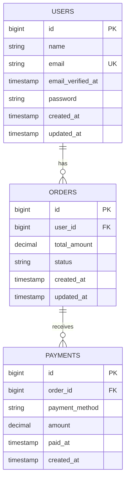

# Payment Platform REST API megvalósítása Laravel környezetben

**base_url:** `http://127.0.0.1:8000/api` vagy `http://127.0.0.1/OnlinePaymentsBearer/public/api`

Az API olyan funkciókkal van ellátva, amelyek lehetővé teszik a fizetési tranzakciók kezelését. A backend fő célja a megrendelések és fizetések nyilvántartása, valamint a felhasználói authentikáció kezelése Bearer token alapú védelemmel.

**Funkciók:**
- Authentikáció (regisztráció, bejelentkezés, token kezelés)
- Felhasználók létrehozhatnak fizetéseket megrendelésekhez
- Payment CRUD műveletek (Create, Read, Update, Delete)
- A teszteléshez készült:
  - 1 Kunta felhasználó (kunta@example.com / Super_Secret_Pw2025!)
  - 10 fake felhasználó magyar nevekkel (jelszó: faker által generált)
  - Minden felhasználóhoz 1-5 megrendelés
  - Minden megrendeléshez 1-3 fizetés

Az adatbázis neve: `paymentPlatform`

---

## Adatbázis Struktúra

Az alkalmazás adatbázisa három fő táblából áll: felhasználók (users), megrendelések (orders) és fizetések (payments). A táblák között hierarchikus kapcsolat van: egy felhasználóhoz több megrendelés tartozhat, és minden megrendeléshez több fizetés is rögzíthető. Az adatbázis MySQL-t használ, Laravel migrációkkal felépítve, foreign key megkötésekkel biztosítva az adatintegritást.

### Users Tábla
A felhasználók alapadatait tárolja.

| Mező | Típus | Leírás |
|------|-------|--------|
| id | bigint | Elsődleges kulcs |
| name | varchar(255) | Felhasználó neve |
| email | varchar(255) | Email cím (egyedi) |
| password | varchar(255) | Hash-elt jelszó |
| email_verified_at | timestamp | Email megerősítés időpontja |
| created_at | timestamp | Létrehozás dátuma |
| updated_at | timestamp | Utolsó módosítás dátuma |

### Orders Tábla
Megrendelések tárolása felhasználókhoz kapcsolva.

| Mező | Típus | Leírás |
|------|-------|--------|
| id | bigint | Elsődleges kulcs |
| user_id | bigint | Foreign key (users.id) |
| total_amount | decimal(10,2) | Megrendelés teljes összege |
| status | varchar(255) | Státusz (pending, processing, completed, cancelled) |
| created_at | timestamp | Létrehozás dátuma |
| updated_at | timestamp | Utolsó módosítás dátuma |

**Kapcsolat:** `belongsTo(User)`, `hasMany(Payment)`

### Payments Tábla
Fizetések tárolása megrendelésekhez kapcsolva.

| Mező | Típus | Leírás |
|------|-------|--------|
| id | bigint | Elsődleges kulcs |
| order_id | bigint | Foreign key (orders.id) |
| payment_method | varchar(255) | Fizetési mód |
| amount | decimal(10,2) | Fizetett összeg |
| paid_at | timestamp | Fizetés időpontja (nullable) |
| created_at | timestamp | Létrehozás dátuma |

**Megjegyzés:** A payments tábla nem rendelkezik `updated_at` mezővel.

**Kapcsolat:** `belongsTo(Order)`

---

## Eloquent Modellek és Kapcsolatok

### User Model
```php
class User extends Authenticatable
{
    use HasFactory, Notifiable, HasApiTokens;
    
    // Kapcsolat
    public function orders(): HasMany
    {
        return $this->hasMany(Order::class);
    }
}
```

### Order Model
```php
class Order extends Model
{
    use HasFactory;
    
    // Kapcsolatok
    public function user(): BelongsTo
    {
        return $this->belongsTo(User::class);
    }
    
    public function payments(): HasMany
    {
        return $this->hasMany(Payment::class);
    }
}
```

### Payment Model
```php
class Payment extends Model
{
    use HasFactory;
    
    const UPDATED_AT = null;
    
    // Kapcsolat
    public function order(): BelongsTo
    {
        return $this->belongsTo(Order::class);
    }
}
```

---

## API Végpontok

A `Content-Type` és az `Accept` headerkulcsok mindig `application/json` formátumúak legyenek.

Érvénytelen vagy hiányzó token esetén a backendnek `401 Unauthorized` választ kell visszaadnia:
```json
Response: 401 Unauthorized
{
  "message": "Unauthenticated."
}
```

### Nem védett végpontok:
- **GET** `/ping` - API teszteléshez
- **POST** `/register` - Regisztrációhoz
- **POST** `/login` - Bejelentkezéshez

### Védett végpontok (Bearer Token szükséges):
- **POST** `/logout` - Kijelentkezés
- **GET** `/user` - Saját felhasználói adatok lekérése
- **GET** `/payments` - Összes payment listázása
- **POST** `/payments` - Új payment létrehozása
- **GET** `/payments/{id}` - Egy payment megtekintése
- **PUT/PATCH** `/payments/{id}` - Payment módosítása
- **DELETE** `/payments/{id}` - Payment törlése

### Hibák:
- **400 Bad Request**: A kérés hibás formátumú. Ezt a hibát akkor kell visszaadni, ha a kérés hibásan van formázva, vagy ha hiányoznak a szükséges mezők.
- **401 Unauthorized**: A felhasználó nem jogosult a kérés végrehajtására. Ezt a hibát akkor kell visszaadni, ha érvénytelen a token.
- **404 Not Found**: A kért erőforrás nem található. Ezt a hibát akkor kell visszaadni, ha a kért payment nem található.
- **422 Unprocessable Entity**: Validációs hiba. A kérés adatai nem felelnek meg a validációs szabályoknak.

---

## Felhasználókezelés

**POST** `/register`

Új felhasználó regisztrálása. Az új felhasználók regisztráció után külön be kell jelentkezniük token megszerzéséhez.

Kérés Törzse:
```JSON
{
    "name": "Test User",
    "email": "test@example.com",
    "password": "password123",
    "password_confirmation": "password123"
}
```

Válasz (sikeres regisztráció esetén): `201 Created`
```JSON
{
    "message": "Registration successful",
    "user": {
        "id": 11,
        "name": "Test User",
        "email": "test@example.com",
        "created_at": "2025-12-04T10:30:00.000000Z",
        "updated_at": "2025-12-04T10:30:00.000000Z"
    }
}
```

Automatikus válasz (ha az e-mail cím már foglalt): `422 Unprocessable Entity`
```JSON
{
  "message": "The email has already been taken.",
  "errors": {
    "email": [
      "The email has already been taken."
    ]
  }
}
```

---

**POST** `/login`

Bejelentkezés e-mail címmel és jelszóval, Bearer token megszerzése.

Kérés Törzse:
```JSON
{
  "email": "kunta@example.com",
  "password": "Super_Secret_Pw2025!"
}
```

Válasz (sikeres bejelentkezés esetén): `200 OK`
```JSON
{
    "message": "Login successful",
    "user": {
        "id": 1,
        "name": "Kunta",
        "email": "kunta@example.com",
        "email_verified_at": null,
        "created_at": "2025-12-04T10:30:00.000000Z",
        "updated_at": "2025-12-04T10:30:00.000000Z"
    },
    "access_token": "1|abcdefghijklmnopqrstuvwxyz123456789",
    "token_type": "Bearer"
}
```

Válasz (sikertelen bejelentkezés esetén): `422 Unprocessable Entity`
```JSON
{
  "message": "The provided credentials are incorrect.",
  "errors": {
    "email": ["The provided credentials are incorrect."]
  }
}
```

---

> Az innen következő végpontok autentikáltak, tehát a kérés headerjében meg kell adni a tokent is

> Authorization: "Bearer 1|abcdefghijklmnopqrstuvwxyz123456789"

**POST** `/logout`

A jelenlegi autentikált felhasználó kijelentkeztetése, a felhasználó tokenjének törlése. Ha a token érvénytelen, a fent meghatározott általános `401 Unauthorized` hibát kell visszaadnia.

Válasz (sikeres kijelentkezés esetén): `200 OK`
```JSON
{
  "message": "Logout successful"
}
```

---

**GET** `/user`

Saját felhasználói profil lekérése.

Válasz: `200 OK`
```JSON
{
    "id": 1,
    "name": "Kunta",
    "email": "kunta@example.com",
    "email_verified_at": null,
    "created_at": "2025-12-04T10:30:00.000000Z",
    "updated_at": "2025-12-04T10:30:00.000000Z"
}
```

---

## Payment Kezelés

**POST** `/payments`

Új fizetés rögzítése egy megrendeléshez.

Kérés törzse:
```JSON
{
  "order_id": 1,
  "payment_method": "credit_card",
  "amount": 150.50,
  "paid_at": "2025-12-04 10:45:00"
}
```

Válasz (sikeres létrehozás, `201 Created`):
```JSON
{
    "success": true,
    "message": "Payment created successfully",
    "data": {
        "id": 1,
        "order_id": 1,
        "payment_method": "credit_card",
        "amount": "150.50",
        "paid_at": "2025-12-04T10:45:00.000000Z",
        "created_at": "2025-12-04T11:00:00.000000Z",
        "order": {
            "id": 1,
            "user_id": 1,
            "total_amount": "150.50",
            "status": "pending"
        }
    }
}
```

*Hibák:*
`422 Unprocessable Entity` – érvénytelen vagy hiányzó mezők, pl. nem létező order_id vagy negatív összeg

`401 Unauthorized` – ha a token érvénytelen vagy hiányzik

---

**GET** `/payments`

Az összes payment listájának lekérése.

Válasz: `200 OK`
```JSON
{
  "success": true,
  "data": [
    {
      "id": 1,
      "order_id": 1,
      "payment_method": "credit_card",
      "amount": "150.50",
      "paid_at": "2025-12-04T10:45:00.000000Z",
      "created_at": "2025-12-04T11:00:00.000000Z",
      "order": {
        "id": 1,
        "user_id": 1,
        "total_amount": "150.50",
        "status": "pending"
      }
    }
  ]
}
```

---

**GET** `/payments/:id`

Információk lekérése egy adott paymentről.

Válasz: `200 OK`
```JSON
{
    "success": true,
    "data": {
        "id": 1,
        "order_id": 1,
        "payment_method": "credit_card",
        "amount": "150.50",
        "paid_at": "2025-12-04T10:45:00.000000Z",
        "created_at": "2025-12-04T11:00:00.000000Z",
        "order": {
            "id": 1,
            "user_id": 1,
            "total_amount": "150.50",
            "status": "pending"
        }
    }
}
```

Automatikus válasz (ha a payment nem található): `404 Not Found`
```JSON
{
  "success": false,
  "message": "Payment not found"
}
```

---

**PUT/PATCH** `/payments/:id`

Payment adatainak frissítése. PUT esetén minden mező kötelező, PATCH esetén csak a módosítani kívánt mezők.

Kérés törzse (PUT):
```JSON
{
  "order_id": 1,
  "payment_method": "bank_transfer",
  "amount": 175.00,
  "paid_at": "2025-12-04 12:00:00"
}
```

Kérés törzse (PATCH):
```JSON
{
  "payment_method": "stripe",
  "amount": 180.00
}
```

Válasz (sikeres frissítés, `200 OK`):
```JSON
{
  "success": true,
  "message": "Payment updated successfully",
  "data": {
    "id": 1,
    "order_id": 1,
    "payment_method": "bank_transfer",
    "amount": "175.00",
    "paid_at": "2025-12-04T12:00:00.000000Z",
    "created_at": "2025-12-04T11:00:00.000000Z",
    "order": {
      "id": 1,
      "user_id": 1,
      "total_amount": "150.50",
      "status": "pending"
    }
  }
}
```

*Hibák:*
`422 Unprocessable Entity` – érvénytelen mezők

`404 Not Found` – payment nem található

`401 Unauthorized` – token érvénytelen

---

**DELETE** `/payments/:id`

Egy payment törlése.

Válasz (sikeres törlés esetén): `200 OK`
```JSON
{
  "success": true,
  "message": "Payment deleted successfully"
}
```

Válasz (ha a payment nem található): `404 Not Found`
```JSON
{
  "success": false,
  "message": "Payment not found"
}
```

Válasz (ha a token érvénytelen vagy hiányzik): `401 Unauthorized`
```JSON
{
  "message": "Unauthenticated."
}
```

---

## Összefoglalva

| HTTP metódus | Útvonal | Jogosultság | Státuszkódok | Rövid leírás |
|--------------|---------|-------------|--------------|--------------|
| GET | /ping | Nyilvános | 200 OK | API teszteléshez |
| POST | /register | Nyilvános | 201 Created, 422 Unprocessable Entity | Új felhasználó regisztrációja |
| POST | /login | Nyilvános | 200 OK, 422 Unprocessable Entity | Bejelentkezés email-lel és jelszóval |
| POST | /logout | Hitelesített | 200 OK, 401 Unauthorized | Kijelentkezés |
| GET | /user | Hitelesített | 200 OK, 401 Unauthorized | Saját profil lekérése |
| GET | /payments | Hitelesített | 200 OK, 401 Unauthorized | Összes payment listázása |
| POST | /payments | Hitelesített | 201 Created, 422 Unprocessable Entity, 401 Unauthorized | Új payment létrehozása |
| GET | /payments/:id | Hitelesített | 200 OK, 404 Not Found, 401 Unauthorized | Egy payment részletei |
| PUT/PATCH | /payments/:id | Hitelesített | 200 OK, 422 Unprocessable Entity, 404 Not Found, 401 Unauthorized | Payment frissítése |
| DELETE | /payments/:id | Hitelesített | 200 OK, 404 Not Found, 401 Unauthorized | Payment törlése |

---

## Factory-k és Seeders

### UserFactory
Magyar neveket és adatokat generál Faker segítségével.

### OrderFactory
Véletlenszerű megrendeléseket hoz létre:
- Véletlenszerű összeg (10-1000 között)
- Státusz: pending, completed, cancelled
- Kapcsolódik egy felhasználóhoz

### PaymentFactory
Véletlenszerű fizetéseket generál:
- Fizetési módok: credit_card, paypal, bank_transfer, stripe
- Összeg: 10-500 között
- Időbélyeg: utolsó 1 hónap

### DatabaseSeeder
Automatikus adatfeltöltés:
- **1 db Kunta felhasználó** (email: kunta@example.com, jelszó: Super_Secret_Pw2025!)
- **10 db fake felhasználó** magyar adatokkal
- Minden felhasználóhoz **1-3 megrendelés**
- Minden megrendeléshez **1-2 fizetés**

---

## Adatbázis diagram



---

## Megvalósítási útmutató
