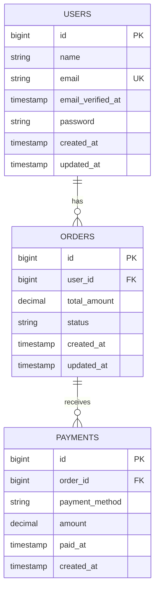

# Payment Platform REST API megvalósítása Laravel környezetben

**base_url:** `http://127.0.0.1:8000/api` vagy `http://127.0.0.1/OnlinePaymentsBearer/public/api`

Az API olyan funkciókkal van ellátva, amelyek lehetővé teszik a fizetési tranzakciók kezelését. A backend fő célja a megrendelések és fizetések nyilvántartása, valamint a felhasználói authentikáció kezelése Bearer token alapú védelemmel.

**Funkciók:**
- Authentikáció (regisztráció, bejelentkezés, token kezelés)
- Felhasználók létrehozhatnak fizetéseket megrendelésekhez
- Payment CRUD műveletek (Create, Read, Update, Delete)
- A teszteléshez készült:
  - 1 Kunta felhasználó (kunta@example.com / Super_Secret_Pw2025!)
  - 10 fake felhasználó magyar nevekkel (jelszó: faker által generált)
  - Minden felhasználóhoz 1-5 megrendelés
  - Minden megrendeléshez 1-3 fizetés

Az adatbázis neve: `paymentPlatform`

---

## Adatbázis Struktúra

Az alkalmazás adatbázisa három fő táblából áll: felhasználók (users), megrendelések (orders) és fizetések (payments). A táblák között hierarchikus kapcsolat van: egy felhasználóhoz több megrendelés tartozhat, és minden megrendeléshez több fizetés is rögzíthető. Az adatbázis MySQL-t használ, Laravel migrációkkal felépítve, foreign key megkötésekkel biztosítva az adatintegritást.

### Users Tábla
A felhasználók alapadatait tárolja.

| Mező | Típus | Leírás |
|------|-------|--------|
| id | bigint | Elsődleges kulcs |
| name | varchar(255) | Felhasználó neve |
| email | varchar(255) | Email cím (egyedi) |
| password | varchar(255) | Hash-elt jelszó |
| email_verified_at | timestamp | Email megerősítés időpontja |
| created_at | timestamp | Létrehozás dátuma |
| updated_at | timestamp | Utolsó módosítás dátuma |

### Orders Tábla
Megrendelések tárolása felhasználókhoz kapcsolva.

| Mező | Típus | Leírás |
|------|-------|--------|
| id | bigint | Elsődleges kulcs |
| user_id | bigint | Foreign key (users.id) |
| total_amount | decimal(10,2) | Megrendelés teljes összege |
| status | varchar(255) | Státusz (pending, processing, completed, cancelled) |
| created_at | timestamp | Létrehozás dátuma |
| updated_at | timestamp | Utolsó módosítás dátuma |

**Kapcsolat:** `belongsTo(User)`, `hasMany(Payment)`

### Payments Tábla
Fizetések tárolása megrendelésekhez kapcsolva.

| Mező | Típus | Leírás |
|------|-------|--------|
| id | bigint | Elsődleges kulcs |
| order_id | bigint | Foreign key (orders.id) |
| payment_method | varchar(255) | Fizetési mód |
| amount | decimal(10,2) | Fizetett összeg |
| paid_at | timestamp | Fizetés időpontja (nullable) |
| created_at | timestamp | Létrehozás dátuma |

**Megjegyzés:** A payments tábla nem rendelkezik `updated_at` mezővel.

**Kapcsolat:** `belongsTo(Order)`

---

## Eloquent Modellek és Kapcsolatok

### User Model (`app/Models/User.php`)
```php
<?php

namespace App\Models;

use Illuminate\Database\Eloquent\Factories\HasFactory;
use Illuminate\Database\Eloquent\Relations\HasMany;
use Illuminate\Foundation\Auth\User as Authenticatable;
use Illuminate\Notifications\Notifiable;
use Laravel\Sanctum\HasApiTokens;

class User extends Authenticatable
{
    use HasFactory, Notifiable, HasApiTokens;

    /**
     * The attributes that are mass assignable.
     *
     * @var array<int, string>
     */
    protected $fillable = [
        'name',
        'email',
        'password',
    ];

    /**
     * The attributes that should be hidden for serialization.
     *
     * @var array<int, string>
     */
    protected $hidden = [
        'password',
        'remember_token',
    ];

    /**
     * Get the attributes that should be cast.
     *
     * @return array<string, string>
     */
    protected function casts(): array
    {
        return [
            'email_verified_at' => 'datetime',
            'password' => 'hashed',
        ];
    }

    /**
     * Kapcsolat: egy felhasználóhoz több megrendelés tartozhat.
     */
    public function orders(): HasMany
    {
        return $this->hasMany(Order::class);
    }
}
```

### Order Model (`app/Models/Order.php`)
```php
<?php

namespace App\Models;

use Illuminate\Database\Eloquent\Factories\HasFactory;
use Illuminate\Database\Eloquent\Model;
use Illuminate\Database\Eloquent\Relations\BelongsTo;
use Illuminate\Database\Eloquent\Relations\HasMany;

class Order extends Model
{
    use HasFactory;

    /**
     * The attributes that are mass assignable.
     *
     * @var array<int, string>
     */
    protected $fillable = [
        'user_id',
        'total_amount',
        'status',
    ];

    /**
     * Kapcsolat: egy megrendelés egy felhasználóhoz tartozik.
     */
    public function user(): BelongsTo
    {
        return $this->belongsTo(User::class);
    }

    /**
     * Kapcsolat: egy megrendeléshez több fizetés tartozhat.
     */
    public function payments(): HasMany
    {
        return $this->hasMany(Payment::class);
    }
}
```

### Payment Model (`app/Models/Payment.php`)
```php
<?php

namespace App\Models;

use Illuminate\Database\Eloquent\Factories\HasFactory;
use Illuminate\Database\Eloquent\Model;
use Illuminate\Database\Eloquent\Relations\BelongsTo;

class Payment extends Model
{
    use HasFactory;

    /**
     * A payments tábla nem rendelkezik updated_at mezővel.
     */
    const UPDATED_AT = null;

    /**
     * The attributes that are mass assignable.
     *
     * @var array<int, string>
     */
    protected $fillable = [
        'order_id',
        'payment_method',
        'amount',
        'paid_at',
    ];

    /**
     * Get the attributes that should be cast.
     *
     * @return array<string, string>
     */
    protected $casts = [
        'paid_at' => 'datetime',
    ];

    /**
     * Kapcsolat: egy fizetés egy megrendeléshez tartozik.
     */
    public function order(): BelongsTo
    {
        return $this->belongsTo(Order::class);
    }
}
```

---

## API Végpontok

A `Content-Type` és az `Accept` headerkulcsok mindig `application/json` formátumúak legyenek.

Érvénytelen vagy hiányzó token esetén a backendnek `401 Unauthorized` választ kell visszaadnia:
```json
Response: 401 Unauthorized
{
  "message": "Unauthenticated."
}
```

### Nem védett végpontok:
- **GET** `/ping` - API teszteléshez
- **POST** `/register` - Regisztrációhoz
- **POST** `/login` - Bejelentkezéshez

### Védett végpontok (Bearer Token szükséges):
- **POST** `/logout` - Kijelentkezés
- **GET** `/user` - Saját felhasználói adatok lekérése
- **GET** `/payments` - Összes payment listázása
- **POST** `/payments` - Új payment létrehozása
- **GET** `/payments/{id}` - Egy payment megtekintése
- **PUT/PATCH** `/payments/{id}` - Payment módosítása
- **DELETE** `/payments/{id}` - Payment törlése

### Hibák:
- **400 Bad Request**: A kérés hibás formátumú. Ezt a hibát akkor kell visszaadni, ha a kérés hibásan van formázva, vagy ha hiányoznak a szükséges mezők.
- **401 Unauthorized**: A felhasználó nem jogosult a kérés végrehajtására. Ezt a hibát akkor kell visszaadni, ha érvénytelen a token.
- **404 Not Found**: A kért erőforrás nem található. Ezt a hibát akkor kell visszaadni, ha a kért payment nem található.
- **422 Unprocessable Entity**: Validációs hiba. A kérés adatai nem felelnek meg a validációs szabályoknak.

---

## Felhasználókezelés

**POST** `/register`

Új felhasználó regisztrálása. Az új felhasználók regisztráció után külön be kell jelentkezniük token megszerzéséhez.

Kérés Törzse:
```JSON
{
    "name": "Test User",
    "email": "test@example.com",
    "password": "password123",
    "password_confirmation": "password123"
}
```

Válasz (sikeres regisztráció esetén): `201 Created`
```JSON
{
    "message": "Registration successful",
    "user": {
        "id": 11,
        "name": "Test User",
        "email": "test@example.com",
        "created_at": "2025-12-04T10:30:00.000000Z",
        "updated_at": "2025-12-04T10:30:00.000000Z"
    }
}
```

Automatikus válasz (ha az e-mail cím már foglalt): `422 Unprocessable Entity`
```JSON
{
  "message": "The email has already been taken.",
  "errors": {
    "email": [
      "The email has already been taken."
    ]
  }
}
```

---

**POST** `/login`

Bejelentkezés e-mail címmel és jelszóval, Bearer token megszerzése.

Kérés Törzse:
```JSON
{
  "email": "kunta@example.com",
  "password": "Super_Secret_Pw2025!"
}
```

Válasz (sikeres bejelentkezés esetén): `200 OK`
```JSON
{
    "message": "Login successful",
    "user": {
        "id": 1,
        "name": "Kunta",
        "email": "kunta@example.com",
        "email_verified_at": null,
        "created_at": "2025-12-04T10:30:00.000000Z",
        "updated_at": "2025-12-04T10:30:00.000000Z"
    },
    "access_token": "1|abcdefghijklmnopqrstuvwxyz123456789",
    "token_type": "Bearer"
}
```

Válasz (sikertelen bejelentkezés esetén): `422 Unprocessable Entity`
```JSON
{
  "message": "The provided credentials are incorrect.",
  "errors": {
    "email": ["The provided credentials are incorrect."]
  }
}
```

---

> Az innen következő végpontok autentikáltak, tehát a kérés headerjében meg kell adni a tokent is

> Authorization: "Bearer 1|abcdefghijklmnopqrstuvwxyz123456789"

**POST** `/logout`

A jelenlegi autentikált felhasználó kijelentkeztetése, a felhasználó tokenjének törlése. Ha a token érvénytelen, a fent meghatározott általános `401 Unauthorized` hibát kell visszaadnia.

Válasz (sikeres kijelentkezés esetén): `200 OK`
```JSON
{
  "message": "Logout successful"
}
```

---

**GET** `/user`

Saját felhasználói profil lekérése.

Válasz: `200 OK`
```JSON
{
    "id": 1,
    "name": "Kunta",
    "email": "kunta@example.com",
    "email_verified_at": null,
    "created_at": "2025-12-04T10:30:00.000000Z",
    "updated_at": "2025-12-04T10:30:00.000000Z"
}
```

---

## Payment Kezelés

**POST** `/payments`

Új fizetés rögzítése egy megrendeléshez.

Kérés törzse:
```JSON
{
  "order_id": 1,
  "payment_method": "credit_card",
  "amount": 150.50,
  "paid_at": "2025-12-04 10:45:00"
}
```

Válasz (sikeres létrehozás, `201 Created`):
```JSON
{
    "success": true,
    "message": "Payment created successfully",
    "data": {
        "id": 1,
        "order_id": 1,
        "payment_method": "credit_card",
        "amount": "150.50",
        "paid_at": "2025-12-04T10:45:00.000000Z",
        "created_at": "2025-12-04T11:00:00.000000Z",
        "order": {
            "id": 1,
            "user_id": 1,
            "total_amount": "150.50",
            "status": "pending"
        }
    }
}
```

*Hibák:*
`422 Unprocessable Entity` – érvénytelen vagy hiányzó mezők, pl. nem létező order_id vagy negatív összeg

`401 Unauthorized` – ha a token érvénytelen vagy hiányzik

---

**GET** `/payments`

Az összes payment listájának lekérése.

Válasz: `200 OK`
```JSON
{
  "success": true,
  "data": [
    {
      "id": 1,
      "order_id": 1,
      "payment_method": "credit_card",
      "amount": "150.50",
      "paid_at": "2025-12-04T10:45:00.000000Z",
      "created_at": "2025-12-04T11:00:00.000000Z",
      "order": {
        "id": 1,
        "user_id": 1,
        "total_amount": "150.50",
        "status": "pending"
      }
    }
  ]
}
```

---

**GET** `/payments/:id`

Információk lekérése egy adott paymentről.

Válasz: `200 OK`
```JSON
{
    "success": true,
    "data": {
        "id": 1,
        "order_id": 1,
        "payment_method": "credit_card",
        "amount": "150.50",
        "paid_at": "2025-12-04T10:45:00.000000Z",
        "created_at": "2025-12-04T11:00:00.000000Z",
        "order": {
            "id": 1,
            "user_id": 1,
            "total_amount": "150.50",
            "status": "pending"
        }
    }
}
```

Automatikus válasz (ha a payment nem található): `404 Not Found`
```JSON
{
  "success": false,
  "message": "Payment not found"
}
```

---

**PUT/PATCH** `/payments/:id`

Payment adatainak frissítése. PUT esetén minden mező kötelező, PATCH esetén csak a módosítani kívánt mezők.

Kérés törzse (PUT):
```JSON
{
  "order_id": 1,
  "payment_method": "bank_transfer",
  "amount": 175.00,
  "paid_at": "2025-12-04 12:00:00"
}
```

Kérés törzse (PATCH):
```JSON
{
  "payment_method": "stripe",
  "amount": 180.00
}
```

Válasz (sikeres frissítés, `200 OK`):
```JSON
{
  "success": true,
  "message": "Payment updated successfully",
  "data": {
    "id": 1,
    "order_id": 1,
    "payment_method": "bank_transfer",
    "amount": "175.00",
    "paid_at": "2025-12-04T12:00:00.000000Z",
    "created_at": "2025-12-04T11:00:00.000000Z",
    "order": {
      "id": 1,
      "user_id": 1,
      "total_amount": "150.50",
      "status": "pending"
    }
  }
}
```

*Hibák:*
`422 Unprocessable Entity` – érvénytelen mezők

`404 Not Found` – payment nem található

`401 Unauthorized` – token érvénytelen

---

**DELETE** `/payments/:id`

Egy payment törlése.

Válasz (sikeres törlés esetén): `200 OK`
```JSON
{
  "success": true,
  "message": "Payment deleted successfully"
}
```

Válasz (ha a payment nem található): `404 Not Found`
```JSON
{
  "success": false,
  "message": "Payment not found"
}
```

Válasz (ha a token érvénytelen vagy hiányzik): `401 Unauthorized`
```JSON
{
  "message": "Unauthenticated."
}
```

---

## Összefoglalva

| HTTP metódus | Útvonal | Jogosultság | Státuszkódok | Rövid leírás |
|--------------|---------|-------------|--------------|--------------|
| GET | /ping | Nyilvános | 200 OK | API teszteléshez |
| POST | /register | Nyilvános | 201 Created, 422 Unprocessable Entity | Új felhasználó regisztrációja |
| POST | /login | Nyilvános | 200 OK, 422 Unprocessable Entity | Bejelentkezés email-lel és jelszóval |
| POST | /logout | Hitelesített | 200 OK, 401 Unauthorized | Kijelentkezés |
| GET | /user | Hitelesített | 200 OK, 401 Unauthorized | Saját profil lekérése |
| GET | /payments | Hitelesített | 200 OK, 401 Unauthorized | Összes payment listázása |
| POST | /payments | Hitelesített | 201 Created, 422 Unprocessable Entity, 401 Unauthorized | Új payment létrehozása |
| GET | /payments/:id | Hitelesített | 200 OK, 404 Not Found, 401 Unauthorized | Egy payment részletei |
| PUT/PATCH | /payments/:id | Hitelesített | 200 OK, 422 Unprocessable Entity, 404 Not Found, 401 Unauthorized | Payment frissítése |
| DELETE | /payments/:id | Hitelesített | 200 OK, 404 Not Found, 401 Unauthorized | Payment törlése |

---

## Factory-k és Seeders

### OrderFactory (`database/factories/OrderFactory.php`)

Véletlenszerű megrendeléseket hoz létre teszteléshez.

```php
<?php

namespace Database\Factories;

use App\Models\User;
use Illuminate\Database\Eloquent\Factories\Factory;

/**
 * @extends \Illuminate\Database\Eloquent\Factories\Factory<\App\Models\Order>
 */
class OrderFactory extends Factory
{
    /**
     * Define the model's default state.
     *
     * @return array<string, mixed>
     */
    public function definition(): array
    {
        return [
            'user_id' => User::factory(),
            'total_amount' => fake()->randomFloat(2, 10, 1000),
            'status' => fake()->randomElement(['pending', 'completed', 'cancelled']),
        ];
    }
}
```

**Generált adatok:**
- `user_id`: Automatikusan létrehozott vagy meglévő felhasználó
- `total_amount`: Véletlenszerű összeg 10 és 1000 között
- `status`: Véletlenszerű státusz (pending, completed, cancelled)

---

### PaymentFactory (`database/factories/PaymentFactory.php`)

Véletlenszerű fizetéseket generál megrendelésekhez.

```php
<?php

namespace Database\Factories;

use App\Models\Order;
use Illuminate\Database\Eloquent\Factories\Factory;

/**
 * @extends \Illuminate\Database\Eloquent\Factories\Factory<\App\Models\Payment>
 */
class PaymentFactory extends Factory
{
    /**
     * Define the model's default state.
     *
     * @return array<string, mixed>
     */
    public function definition(): array
    {
        return [
            'order_id' => Order::factory(),
            'payment_method' => fake()->randomElement(['credit_card', 'bank_transfer', 'paypal', 'stripe']),
            'amount' => fake()->randomFloat(2, 10, 500),
            'paid_at' => fake()->dateTimeBetween('-1 month', 'now'),
        ];
    }
}
```

**Generált adatok:**
- `order_id`: Automatikusan létrehozott vagy meglévő megrendelés
- `payment_method`: Véletlenszerű fizetési mód (credit_card, bank_transfer, paypal, stripe)
- `amount`: Véletlenszerű összeg 10 és 500 között
- `paid_at`: Véletlenszerű dátum az elmúlt 1 hónapból

---

### DatabaseSeeder (`database/seeders/DatabaseSeeder.php`)

Automatikus adatfeltöltés az adatbázisba.

```php
<?php

namespace Database\Seeders;

use App\Models\User;
use App\Models\Order;
use App\Models\Payment;
use Illuminate\Database\Seeder;

class DatabaseSeeder extends Seeder
{
    /**
     * Seed the application's database.
     */
    public function run(): void
    {
        // Kunta felhasználó létrehozása
        $kunta = User::factory()->create([
            'name' => 'Kunta',
            'email' => 'kunta@example.com',
            'password' => bcrypt('Super_Secret_Pw2025!'),
        ]);

        // 10 fake felhasználó magyar adatokkal
        User::factory(10)->create()->each(function ($user) {
            // Minden felhasználóhoz 1-3 megrendelés
            Order::factory(rand(1, 3))->create([
                'user_id' => $user->id,
            ])->each(function ($order) {
                // Minden megrendeléshez 1-2 fizetés
                Payment::factory(rand(1, 2))->create([
                    'order_id' => $order->id,
                ]);
            });
        });
    }
}
```

**Létrehozott adatok:**
- **1 Kunta felhasználó**: email: `kunta@example.com`, jelszó: `Super_Secret_Pw2025!`
- **10 fake felhasználó**: Magyar nevekkel és adatokkal (APP_FAKER_LOCALE=hu_HU)
- **10-30 megrendelés**: Minden felhasználóhoz 1-3 megrendelés
- **10-60 fizetés**: Minden megrendeléshez 1-2 fizetés

**Seeder futtatása:**
```bash
php artisan db:seed
```

**Adatbázis frissítése és újra feltöltése:**
```bash
php artisan migrate:fresh --seed
```

---

## Adatbázis diagram



---

## Megvalósítási útmutató

### I. Modul – Környezet beállítása

**1. Projekt létrehozása és függőségek telepítése**
```bash
composer create-project laravel/laravel OnlinePaymentsBearer
cd OnlinePaymentsBearer
composer require laravel/sanctum
php artisan vendor:publish --provider="Laravel\Sanctum\SanctumServiceProvider"
```

**2. `.env` fájl beállítása**
```env
DB_CONNECTION=mysql
DB_HOST=127.0.0.1
DB_PORT=3306
DB_DATABASE=paymentPlatform
DB_USERNAME=root
DB_PASSWORD=

APP_TIMEZONE=Europe/Budapest
APP_FAKER_LOCALE=hu_HU
```

**3. Adatbázis migrációk létrehozása**
```bash
php artisan make:migration create_orders_table
php artisan make:migration create_payments_table
```

**`database/migrations/2025_12_01_081745_create_orders_table.php`:**
```php
<?php

use Illuminate\Database\Migrations\Migration;
use Illuminate\Database\Schema\Blueprint;
use Illuminate\Support\Facades\Schema;

return new class extends Migration
{
    /**
     * Run the migrations.
     */
    public function up(): void
    {
        Schema::create('orders', function (Blueprint $table) {
            $table->id();
            $table->foreignId('user_id')->constrained()->onDelete('cascade');
            $table->decimal('total_amount', 10, 2);
            $table->string('status')->default('pending');
            $table->timestamps();
        });
    }

    /**
     * Reverse the migrations.
     */
    public function down(): void
    {
        Schema::dropIfExists('orders');
    }
};
```

**`database/migrations/2025_12_01_081802_create_payments_table.php`:**
```php
<?php

use Illuminate\Database\Migrations\Migration;
use Illuminate\Database\Schema\Blueprint;
use Illuminate\Support\Facades\Schema;

return new class extends Migration
{
    /**
     * Run the migrations.
     */
    public function up(): void
    {
        Schema::create('payments', function (Blueprint $table) {
            $table->id();
            $table->foreignId('order_id')->constrained()->onDelete('cascade');
            $table->string('payment_method');
            $table->decimal('amount', 10, 2);
            $table->timestamp('paid_at');
            $table->timestamp('created_at')->useCurrent();
        });
    }

    /**
     * Reverse the migrations.
     */
    public function down(): void
    {
        Schema::dropIfExists('payments');
    }
};
```

**4. Migrációk futtatása**
```bash
php artisan migrate
```

---

### II. Modul – Modellek, Factory-k és Seederek

**1. Modellek létrehozása**
```bash
php artisan make:model Order
php artisan make:model Payment
```

A modellek teljes kódját lásd fent az **"Eloquent Modellek és Kapcsolatok"** részben.

**2. Factory-k létrehozása**
```bash
php artisan make:factory OrderFactory
php artisan make:factory PaymentFactory
```

A factory-k teljes kódját lásd fent a **"Factory-k és Seeders"** részben.

**3. Seeder futtatása**
```bash
php artisan db:seed
```

---

### III. Modul – Controller-ek és Route-ok

**1. Controller-ek létrehozása**
```bash
php artisan make:controller AuthController
php artisan make:controller PaymentController --resource
```

**`app/Http/Controllers/AuthController.php`:**
```php
<?php

namespace App\Http\Controllers;

use App\Models\User;
use Illuminate\Http\Request;
use Illuminate\Support\Facades\Hash;
use Illuminate\Support\Facades\Validator;

class AuthController extends Controller
{
    /**
     * Regisztráció - új felhasználó létrehozása token nélkül
     */
    public function register(Request $request)
    {
        $validator = Validator::make($request->all(), [
            'name' => 'required|string|max:255',
            'email' => 'required|string|email|max:255|unique:users',
            'password' => 'required|string|min:8|confirmed',
        ]);

        if ($validator->fails()) {
            return response()->json($validator->errors(), 422);
        }

        $user = User::create([
            'name' => $request->name,
            'email' => $request->email,
            'password' => Hash::make($request->password),
        ]);

        return response()->json([
            'message' => 'Registration successful',
            'user' => $user,
        ], 201);
    }

    /**
     * Bejelentkezés - token generálása
     */
    public function login(Request $request)
    {
        $validator = Validator::make($request->all(), [
            'email' => 'required|email',
            'password' => 'required',
        ]);

        if ($validator->fails()) {
            return response()->json($validator->errors(), 422);
        }

        $user = User::where('email', $request->email)->first();

        if (!$user || !Hash::check($request->password, $user->password)) {
            return response()->json([
                'message' => 'The provided credentials are incorrect.',
                'errors' => [
                    'email' => ['The provided credentials are incorrect.']
                ]
            ], 422);
        }

        $token = $user->createToken('auth_token')->plainTextToken;

        return response()->json([
            'message' => 'Login successful',
            'user' => $user,
            'access_token' => $token,
            'token_type' => 'Bearer',
        ]);
    }

    /**
     * Kijelentkezés - token törlése
     */
    public function logout(Request $request)
    {
        $request->user()->currentAccessToken()->delete();
        return response()->json(['message' => 'Logout successful']);
    }
}
```

**`app/Http/Controllers/PaymentController.php`:**
```php
<?php

namespace App\Http\Controllers;

use App\Models\Payment;
use Illuminate\Http\Request;
use Illuminate\Support\Facades\Validator;

class PaymentController extends Controller
{
    /**
     * Display a listing of the resource.
     */
    public function index()
    {
        $payments = Payment::with('order')->get();
        return response()->json(['success' => true, 'data' => $payments]);
    }

    /**
     * Store a newly created resource in storage.
     */
    public function store(Request $request)
    {
        $validator = Validator::make($request->all(), [
            'order_id' => 'required|exists:orders,id',
            'payment_method' => 'required|string',
            'amount' => 'required|numeric|min:0',
            'paid_at' => 'required|date',
        ]);

        if ($validator->fails()) {
            return response()->json($validator->errors(), 422);
        }

        $payment = Payment::create($request->all());
        $payment->load('order');

        return response()->json([
            'success' => true,
            'message' => 'Payment created successfully',
            'data' => $payment,
        ], 201);
    }

    /**
     * Display the specified resource.
     */
    public function show(string $id)
    {
        $payment = Payment::with('order')->find($id);

        if (!$payment) {
            return response()->json([
                'success' => false,
                'message' => 'Payment not found'
            ], 404);
        }

        return response()->json(['success' => true, 'data' => $payment]);
    }

    /**
     * Update the specified resource in storage.
     */
    public function update(Request $request, string $id)
    {
        $payment = Payment::find($id);

        if (!$payment) {
            return response()->json([
                'success' => false,
                'message' => 'Payment not found'
            ], 404);
        }

        // PUT esetén minden mező kötelező, PATCH esetén opcionális
        $rules = $request->isMethod('put') ? [
            'order_id' => 'required|exists:orders,id',
            'payment_method' => 'required|string',
            'amount' => 'required|numeric|min:0',
            'paid_at' => 'required|date',
        ] : [
            'order_id' => 'sometimes|exists:orders,id',
            'payment_method' => 'sometimes|string',
            'amount' => 'sometimes|numeric|min:0',
            'paid_at' => 'sometimes|date',
        ];

        $validator = Validator::make($request->all(), $rules);

        if ($validator->fails()) {
            return response()->json($validator->errors(), 422);
        }

        $payment->update($request->all());
        $payment->load('order');

        return response()->json([
            'success' => true,
            'message' => 'Payment updated successfully',
            'data' => $payment,
        ]);
    }

    /**
     * Remove the specified resource from storage.
     */
    public function destroy(string $id)
    {
        $payment = Payment::find($id);

        if (!$payment) {
            return response()->json([
                'success' => false,
                'message' => 'Payment not found'
            ], 404);
        }

        $payment->delete();

        return response()->json([
            'success' => true,
            'message' => 'Payment deleted successfully'
        ]);
    }
}
```

**2. Route-ok beállítása (`routes/api.php`):**
```php
<?php

use App\Http\Controllers\AuthController;
use App\Http\Controllers\PaymentController;
use Illuminate\Http\Request;
use Illuminate\Support\Facades\Route;

// Ping endpoint - API teszteléshez
Route::get('/ping', function () {
    return response()->json(['message' => 'pong']);
});

// Publikus végpontok
Route::post('/register', [AuthController::class, 'register']);
Route::post('/login', [AuthController::class, 'login']);

// Védett végpontok (Bearer Token szükséges)
Route::middleware('auth:sanctum')->group(function () {
    Route::post('/logout', [AuthController::class, 'logout']);
    Route::get('/user', function (Request $request) {
        return $request->user();
    });
    
    // Payment CRUD
    Route::apiResource('payments', PaymentController::class);
});
```

**3. Sanctum middleware konfigurálása (`bootstrap/app.php`):**
```php
<?php

use Illuminate\Foundation\Application;
use Illuminate\Foundation\Configuration\Exceptions;
use Illuminate\Foundation\Configuration\Middleware;

return Application::configure(basePath: dirname(__DIR__))
    ->withRouting(
        web: __DIR__.'/../routes/web.php',
        api: __DIR__.'/../routes/api.php',
        commands: __DIR__.'/../routes/console.php',
        health: '/up',
    )
    ->withMiddleware(function (Middleware $middleware) {
        $middleware->api(prepend: [
            \Laravel\Sanctum\Http\Middleware\EnsureFrontendRequestsAreStateful::class,
        ]);
    })
    ->withExceptions(function (Exceptions $exceptions) {
        //
    })->create();
```

---

### IV. Modul – Tesztelés

**1. Test fájlok létrehozása**
```bash
php artisan make:test AuthTest
php artisan make:test PaymentTest
```

**`tests/Feature/AuthTest.php`:**
```php
<?php

namespace Tests\Feature;

use App\Models\User;
use Illuminate\Foundation\Testing\RefreshDatabase;
use Tests\TestCase;

class AuthTest extends TestCase
{
    use RefreshDatabase;

    public function test_ping_endpoint_returns_pong(): void
    {
        $response = $this->getJson('/api/ping');

        $response->assertStatus(200)
                 ->assertJson(['message' => 'pong']);
    }

    public function test_user_can_register_with_valid_data(): void
    {
        $response = $this->postJson('/api/register', [
            'name' => 'Test User',
            'email' => 'test@example.com',
            'password' => 'password123',
            'password_confirmation' => 'password123',
        ]);

        $response->assertStatus(201)
                 ->assertJsonStructure(['message', 'user']);
        $this->assertDatabaseHas('users', ['email' => 'test@example.com']);
    }

    public function test_user_cannot_register_with_existing_email(): void
    {
        User::factory()->create(['email' => 'existing@example.com']);

        $response = $this->postJson('/api/register', [
            'name' => 'Test User',
            'email' => 'existing@example.com',
            'password' => 'password123',
            'password_confirmation' => 'password123',
        ]);

        $response->assertStatus(422)
                 ->assertJsonValidationErrors(['email']);
    }

    public function test_user_cannot_register_with_missing_password_confirmation(): void
    {
        $response = $this->postJson('/api/register', [
            'name' => 'Test User',
            'email' => 'test@example.com',
            'password' => 'password123',
        ]);

        $response->assertStatus(422)
                 ->assertJsonValidationErrors(['password']);
    }

    public function test_user_can_login_with_valid_credentials(): void
    {
        $user = User::factory()->create([
            'password' => bcrypt('password123'),
        ]);

        $response = $this->postJson('/api/login', [
            'email' => $user->email,
            'password' => 'password123',
        ]);

        $response->assertStatus(200)
                 ->assertJsonStructure(['message', 'user', 'access_token', 'token_type']);
    }

    public function test_user_cannot_login_with_invalid_credentials(): void
    {
        $user = User::factory()->create();

        $response = $this->postJson('/api/login', [
            'email' => $user->email,
            'password' => 'wrongpassword',
        ]);

        $response->assertStatus(422);
    }

    public function test_user_cannot_login_with_invalid_email_format(): void
    {
        $response = $this->postJson('/api/login', [
            'email' => 'not-an-email',
            'password' => 'password123',
        ]);

        $response->assertStatus(422)
                 ->assertJsonValidationErrors(['email']);
    }

    public function test_authenticated_user_can_logout(): void
    {
        $user = User::factory()->create();
        $token = $user->createToken('test-token')->plainTextToken;

        $response = $this->withHeaders([
            'Authorization' => 'Bearer ' . $token,
        ])->postJson('/api/logout');

        $response->assertStatus(200)
                 ->assertJson(['message' => 'Logout successful']);
    }

    public function test_authenticated_user_can_get_user_data(): void
    {
        $user = User::factory()->create();
        $token = $user->createToken('test-token')->plainTextToken;

        $response = $this->withHeaders([
            'Authorization' => 'Bearer ' . $token,
        ])->getJson('/api/user');

        $response->assertStatus(200)
                 ->assertJson([
                     'id' => $user->id,
                     'email' => $user->email,
                 ]);
    }
}
```

**`tests/Feature/PaymentTest.php`:**
```php
<?php

namespace Tests\Feature;

use App\Models\Order;
use App\Models\Payment;
use App\Models\User;
use Illuminate\Foundation\Testing\RefreshDatabase;
use Tests\TestCase;

class PaymentTest extends TestCase
{
    use RefreshDatabase;

    private function authenticatedUser()
    {
        $user = User::factory()->create();
        $token = $user->createToken('test-token')->plainTextToken;
        return ['user' => $user, 'token' => $token];
    }

    public function test_can_create_payment_with_valid_data(): void
    {
        $auth = $this->authenticatedUser();
        $order = Order::factory()->create(['user_id' => $auth['user']->id]);

        $response = $this->withHeaders([
            'Authorization' => 'Bearer ' . $auth['token'],
        ])->postJson('/api/payments', [
            'order_id' => $order->id,
            'payment_method' => 'credit_card',
            'amount' => 100.50,
            'paid_at' => '2025-12-04 10:00:00',
        ]);

        $response->assertStatus(201)
                 ->assertJsonStructure(['success', 'message', 'data']);
        $this->assertDatabaseHas('payments', ['order_id' => $order->id]);
    }

    public function test_cannot_create_payment_without_authentication(): void
    {
        $order = Order::factory()->create();

        $response = $this->postJson('/api/payments', [
            'order_id' => $order->id,
            'payment_method' => 'credit_card',
            'amount' => 100.50,
            'paid_at' => '2025-12-04 10:00:00',
        ]);

        $response->assertStatus(401);
    }

    public function test_cannot_create_payment_with_invalid_order_id(): void
    {
        $auth = $this->authenticatedUser();

        $response = $this->withHeaders([
            'Authorization' => 'Bearer ' . $auth['token'],
        ])->postJson('/api/payments', [
            'order_id' => 99999,
            'payment_method' => 'credit_card',
            'amount' => 100.50,
            'paid_at' => '2025-12-04 10:00:00',
        ]);

        $response->assertStatus(422)
                 ->assertJsonValidationErrors(['order_id']);
    }

    public function test_cannot_create_payment_with_negative_amount(): void
    {
        $auth = $this->authenticatedUser();
        $order = Order::factory()->create(['user_id' => $auth['user']->id]);

        $response = $this->withHeaders([
            'Authorization' => 'Bearer ' . $auth['token'],
        ])->postJson('/api/payments', [
            'order_id' => $order->id,
            'payment_method' => 'credit_card',
            'amount' => -50,
            'paid_at' => '2025-12-04 10:00:00',
        ]);

        $response->assertStatus(422)
                 ->assertJsonValidationErrors(['amount']);
    }

    public function test_can_list_all_payments(): void
    {
        $auth = $this->authenticatedUser();
        Payment::factory()->count(3)->create();

        $response = $this->withHeaders([
            'Authorization' => 'Bearer ' . $auth['token'],
        ])->getJson('/api/payments');

        $response->assertStatus(200)
                 ->assertJsonStructure(['success', 'data']);
    }

    public function test_cannot_list_payments_without_authentication(): void
    {
        $response = $this->getJson('/api/payments');
        $response->assertStatus(401);
    }

    public function test_can_show_single_payment(): void
    {
        $auth = $this->authenticatedUser();
        $payment = Payment::factory()->create();

        $response = $this->withHeaders([
            'Authorization' => 'Bearer ' . $auth['token'],
        ])->getJson('/api/payments/' . $payment->id);

        $response->assertStatus(200)
                 ->assertJson(['success' => true]);
    }

    public function test_returns_404_for_nonexistent_payment(): void
    {
        $auth = $this->authenticatedUser();

        $response = $this->withHeaders([
            'Authorization' => 'Bearer ' . $auth['token'],
        ])->getJson('/api/payments/99999');

        $response->assertStatus(404)
                 ->assertJson(['success' => false, 'message' => 'Payment not found']);
    }

    public function test_can_update_payment_with_put(): void
    {
        $auth = $this->authenticatedUser();
        $payment = Payment::factory()->create();

        $response = $this->withHeaders([
            'Authorization' => 'Bearer ' . $auth['token'],
        ])->putJson('/api/payments/' . $payment->id, [
            'order_id' => $payment->order_id,
            'payment_method' => 'bank_transfer',
            'amount' => 200.00,
            'paid_at' => '2025-12-05 12:00:00',
        ]);

        $response->assertStatus(200)
                 ->assertJson(['success' => true, 'message' => 'Payment updated successfully']);
    }

    public function test_can_update_payment_with_patch(): void
    {
        $auth = $this->authenticatedUser();
        $payment = Payment::factory()->create();

        $response = $this->withHeaders([
            'Authorization' => 'Bearer ' . $auth['token'],
        ])->patchJson('/api/payments/' . $payment->id, [
            'payment_method' => 'stripe',
        ]);

        $response->assertStatus(200)
                 ->assertJson(['success' => true, 'message' => 'Payment updated successfully']);
    }

    public function test_returns_404_when_updating_nonexistent_payment(): void
    {
        $auth = $this->authenticatedUser();

        $response = $this->withHeaders([
            'Authorization' => 'Bearer ' . $auth['token'],
        ])->putJson('/api/payments/99999', [
            'order_id' => 1,
            'payment_method' => 'credit_card',
            'amount' => 100,
            'paid_at' => '2025-12-04 10:00:00',
        ]);

        $response->assertStatus(404);
    }

    public function test_can_delete_payment(): void
    {
        $auth = $this->authenticatedUser();
        $payment = Payment::factory()->create();

        $response = $this->withHeaders([
            'Authorization' => 'Bearer ' . $auth['token'],
        ])->deleteJson('/api/payments/' . $payment->id);

        $response->assertStatus(200)
                 ->assertJson(['success' => true, 'message' => 'Payment deleted successfully']);
        $this->assertDatabaseMissing('payments', ['id' => $payment->id]);
    }

    public function test_returns_404_when_deleting_nonexistent_payment(): void
    {
        $auth = $this->authenticatedUser();

        $response = $this->withHeaders([
            'Authorization' => 'Bearer ' . $auth['token'],
        ])->deleteJson('/api/payments/99999');

        $response->assertStatus(404);
    }

    public function test_cannot_delete_payment_without_authentication(): void
    {
        $payment = Payment::factory()->create();

        $response = $this->deleteJson('/api/payments/' . $payment->id);
        $response->assertStatus(401);
    }
}
```

**2. Tesztek futtatása**
```bash
php artisan test
```

**Várt eredmények:**
```
PASS  Tests\Unit\ExampleTest
✓ that true is true

PASS  Tests\Feature\AuthTest
✓ ping endpoint returns pong
✓ user can register with valid data
✓ user cannot register with existing email
✓ user cannot register with missing password confirmation
✓ user can login with valid credentials
✓ user cannot login with invalid credentials
✓ user cannot login with invalid email format
✓ authenticated user can logout
✓ authenticated user can get user data

PASS  Tests\Feature\PaymentTest
✓ can create payment with valid data
✓ cannot create payment without authentication
✓ cannot create payment with invalid order id
✓ cannot create payment with negative amount
✓ can list all payments
✓ cannot list payments without authentication
✓ can show single payment
✓ returns 404 for nonexistent payment
✓ can update payment with put
✓ can update payment with patch
✓ returns 404 when updating nonexistent payment
✓ can delete payment
✓ returns 404 when deleting nonexistent payment
✓ cannot delete payment without authentication

PASS  Tests\Feature\ExampleTest
✓ the application returns a successful response

Tests:    25 passed (112 assertions)
Duration: 1.24s
```


---

## Telepítési útmutató

**1. Adatbázis konfigurálása:**
- Hozz létre egy `paymentPlatform` nevű adatbázist
- Állítsd be a `.env` fájlban az adatbázis kapcsolatot

**2. Migrációk és seed:**
```bash
php artisan migrate
php artisan db:seed
```

**3. Fejlesztői szerver indítása:**
```bash
php artisan serve
```

**4. API elérése:**
- Base URL: `http://127.0.0.1:8000/api`
- Teszt felhasználó: `kunta@example.com` / `Super_Secret_Pw2025!`

---

## Képernyőképek

### Postman feladatok


### Test eredmények


---

