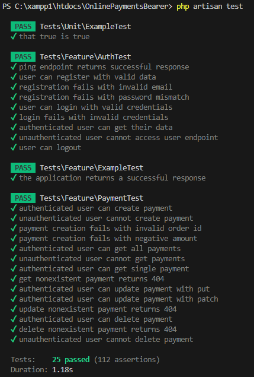

# Payment Platform - Teljes Dokumentáció

## Projekt Áttekintés

A Payment Platform egy Laravel alapú REST API alkalmazás, amely fizetési tranzakciók kezelésére szolgál. Az alkalmazás támogatja a felhasználói authentikációt, megrendelések nyilvántartását és a hozzájuk kapcsolódó fizetések teljes körű menedzsmentjét.

### Technológiai Stack

- **Backend Framework:** Laravel 11
- **Authentikáció:** Laravel Sanctum (Bearer Token)
- **Adatbázis:** MySQL
- **Teszt Framework:** PHPUnit
- **API Tesztelés:** Postman
- **Locale:** Magyar (hu_HU)
- **Timezone:** Europe/Budapest

---

## Adatbázis Struktúra

### Users Tábla
A felhasználók alapadatait tárolja.

| Mező | Típus | Leírás |
|------|-------|--------|
| id | bigint | Elsődleges kulcs |
| name | varchar(255) | Felhasználó neve |
| email | varchar(255) | Email cím (egyedi) |
| password | varchar(255) | Hash-elt jelszó |
| email_verified_at | timestamp | Email megerősítés időpontja |
| created_at | timestamp | Létrehozás dátuma |
| updated_at | timestamp | Utolsó módosítás dátuma |

### Orders Tábla
Megrendelések tárolása felhasználókhoz kapcsolva.

| Mező | Típus | Leírás |
|------|-------|--------|
| id | bigint | Elsődleges kulcs |
| user_id | bigint | Foreign key (users.id) |
| total_amount | decimal(10,2) | Megrendelés teljes összege |
| status | varchar(255) | Státusz (pending, processing, completed, cancelled) |
| created_at | timestamp | Létrehozás dátuma |
| updated_at | timestamp | Utolsó módosítás dátuma |

**Kapcsolat:** `belongsTo(User)`, `hasMany(Payment)`

### Payments Tábla
Fizetések tárolása megrendelésekhez kapcsolva.

| Mező | Típus | Leírás |
|------|-------|--------|
| id | bigint | Elsődleges kulcs |
| order_id | bigint | Foreign key (orders.id) |
| payment_method | varchar(255) | Fizetési mód |
| amount | decimal(10,2) | Fizetett összeg |
| paid_at | timestamp | Fizetés időpontja (nullable) |
| created_at | timestamp | Létrehozás dátuma |

**Megjegyzés:** A payments tábla nem rendelkezik `updated_at` mezővel.

**Kapcsolat:** `belongsTo(Order)`

---

## Eloquent Modellek és Kapcsolatok

### User Model
```php
class User extends Authenticatable
{
    use HasFactory, Notifiable, HasApiTokens;
    
    // Kapcsolat
    public function orders(): HasMany
    {
        return $this->hasMany(Order::class);
    }
}
```

### Order Model
```php
class Order extends Model
{
    use HasFactory;
    
    // Kapcsolatok
    public function user(): BelongsTo
    {
        return $this->belongsTo(User::class);
    }
    
    public function payments(): HasMany
    {
        return $this->hasMany(Payment::class);
    }
}
```

### Payment Model
```php
class Payment extends Model
{
    use HasFactory;
    
    const UPDATED_AT = null;
    
    // Kapcsolat
    public function order(): BelongsTo
    {
        return $this->belongsTo(Order::class);
    }
}
```

---

## Factory-k és Seeders

### UserFactory
Magyar neveket és adatokat generál Faker segítségével.

### OrderFactory
Véletlenszerű megrendeléseket hoz létre:
- Véletlenszerű összeg (10-5000 között)
- Státusz: pending, processing, completed, cancelled
- Időbélyeg: utolsó 6 hónap

### PaymentFactory
Véletlenszerű fizetéseket generál:
- Fizetési módok: credit_card, paypal, bank_transfer, cash, stripe
- Összeg: 10-5000 között
- 80% eséllyel kitöltött `paid_at` mező

### DatabaseSeeder
Automatikus adatfeltöltés:
- **1 db Kunta felhasználó** (email: kunta@example.com, jelszó: Super_Secret_Pw2025!)
- **10 db fake felhasználó** magyar adatokkal
- Minden felhasználóhoz **1-5 megrendelés**
- Minden megrendeléshez **1-3 fizetés**

---

## API Végpontok

### Base URL
```
http://localhost:8000/api
```

### Authentikáció
Az API Laravel Sanctum alapú Bearer Token authentikációt használ.

**Token használat:**
```
Authorization: Bearer YOUR_TOKEN_HERE
```

---

## Publikus Végpontok

### 1. Ping - Szerver Ellenőrzés

**Endpoint:** `GET /api/ping`

**Leírás:** Egyszerű végpont a szerver működésének tesztelésére.

**Request:**
```
GET http://localhost:8000/api/ping
Headers:
  Accept: application/json
```

**Response (200):**
```json
{
    "success": true,
    "message": "pong",
    "timestamp": "2025-12-04T12:30:45+00:00",
    "server_time": "2025-12-04 12:30:45"
}
```

---

### 2. Regisztráció

**Endpoint:** `POST /api/register`

**Leírás:** Új felhasználó létrehozása. A sikeres regisztráció után külön be kell jelentkezni.

**Request:**
```json
POST http://localhost:8000/api/register
Headers:
  Content-Type: application/json
  Accept: application/json

Body:
{
    "name": "Test User",
    "email": "test@example.com",
    "password": "password123",
    "password_confirmation": "password123"
}
```

**Validációs Szabályok:**
- `name`: kötelező, max 255 karakter
- `email`: kötelező, valid email, egyedi
- `password`: kötelező, min 8 karakter, megerősítés kötelező

**Response (201):**
```json
{
    "message": "Registration successful",
    "user": {
        "name": "Test User",
        "email": "test@example.com",
        "updated_at": "2025-12-04T10:30:00.000000Z",
        "created_at": "2025-12-04T10:30:00.000000Z",
        "id": 1
    }
}
```

---

### 3. Bejelentkezés

**Endpoint:** `POST /api/login`

**Leírás:** Bejelentkezés és Bearer token megszerzése.

**Request:**
```json
POST http://localhost:8000/api/login
Headers:
  Content-Type: application/json
  Accept: application/json

Body:
{
    "email": "kunta@example.com",
    "password": "Super_Secret_Pw2025!"
}
```

**Response (200):**
```json
{
    "message": "Login successful",
    "user": {
        "id": 1,
        "name": "Kunta",
        "email": "kunta@example.com",
        "email_verified_at": null,
        "created_at": "2025-12-04T10:30:00.000000Z",
        "updated_at": "2025-12-04T10:30:00.000000Z"
    },
    "access_token": "1|abcdefghijklmnopqrstuvwxyz123456789",
    "token_type": "Bearer"
}
```

**⚠️ FONTOS:** Az `access_token` értékét mentsd el! Ez szükséges a védett végpontokhoz.

---

## Védett Végpontok

Az alábbi végpontok Bearer Token authentikációt igényelnek.

### 4. Bejelentkezett Felhasználó Adatai

**Endpoint:** `GET /api/user`

**Request:**
```
GET http://localhost:8000/api/user
Headers:
  Accept: application/json
  Authorization: Bearer {{token}}
```

**Response (200):**
```json
{
    "id": 1,
    "name": "Kunta",
    "email": "kunta@example.com",
    "email_verified_at": null,
    "created_at": "2025-12-04T10:30:00.000000Z",
    "updated_at": "2025-12-04T10:30:00.000000Z"
}
```

---

### 5. Kijelentkezés

**Endpoint:** `POST /api/logout`

**Leírás:** A jelenlegi token érvénytelenítése.

**Request:**
```
POST http://localhost:8000/api/logout
Headers:
  Accept: application/json
  Authorization: Bearer {{token}}
```

**Response (200):**
```json
{
    "message": "Logout successful"
}
```

---

## Payment CRUD Műveletek

### 6. Payment Létrehozása

**Endpoint:** `POST /api/payments`

**Leírás:** Új fizetés rögzítése egy megrendeléshez.

**Request:**
```json
POST http://localhost:8000/api/payments
Headers:
  Content-Type: application/json
  Accept: application/json
  Authorization: Bearer {{token}}

Body:
{
    "order_id": 1,
    "payment_method": "credit_card",
    "amount": 150.50,
    "paid_at": "2025-12-04 10:45:00"
}
```

**Validációs Szabályok:**
- `order_id`: kötelező, létező order
- `payment_method`: kötelező, string
- `amount`: kötelező, pozitív szám
- `paid_at`: opcionális, datetime

**Response (201):**
```json
{
    "success": true,
    "message": "Payment created successfully",
    "data": {
        "id": 1,
        "order_id": 1,
        "payment_method": "credit_card",
        "amount": "150.50",
        "paid_at": "2025-12-04T10:45:00.000000Z",
        "created_at": "2025-12-04T11:00:00.000000Z",
        "order": {
            "id": 1,
            "user_id": 1,
            "total_amount": "150.50",
            "status": "pending"
        }
    }
}
```

---

### 7. Összes Payment Lekérése

**Endpoint:** `GET /api/payments`

**Request:**
```
GET http://localhost:8000/api/payments
Headers:
  Accept: application/json
  Authorization: Bearer {{token}}
```

**Response (200):**
```json
{
    "success": true,
    "data": [
        {
            "id": 1,
            "order_id": 1,
            "payment_method": "credit_card",
            "amount": "150.50",
            "paid_at": "2025-12-04T10:45:00.000000Z",
            "created_at": "2025-12-04T11:00:00.000000Z",
            "order": { ... }
        }
    ]
}
```

---

### 8. Egy Payment Lekérése

**Endpoint:** `GET /api/payments/{id}`

**Request:**
```
GET http://localhost:8000/api/payments/1
Headers:
  Accept: application/json
  Authorization: Bearer {{token}}
```

**Response (200):**
```json
{
    "success": true,
    "data": {
        "id": 1,
        "order_id": 1,
        "payment_method": "credit_card",
        "amount": "150.50",
        "paid_at": "2025-12-04T10:45:00.000000Z",
        "created_at": "2025-12-04T11:00:00.000000Z",
        "order": { ... }
    }
}
```

**Response (404):**
```json
{
    "success": false,
    "message": "Payment not found"
}
```

---

### 9. Payment Frissítése (PUT)

**Endpoint:** `PUT /api/payments/{id}`

**Leírás:** Teljes frissítés - minden mezőt meg kell adni.

**Request:**
```json
PUT http://localhost:8000/api/payments/1
Headers:
  Content-Type: application/json
  Accept: application/json
  Authorization: Bearer {{token}}

Body:
{
    "order_id": 1,
    "payment_method": "bank_transfer",
    "amount": 175.00,
    "paid_at": "2025-12-04 12:00:00"
}
```

**Response (200):**
```json
{
    "success": true,
    "message": "Payment updated successfully",
    "data": { ... }
}
```

---

### 10. Payment Frissítése (PATCH)

**Endpoint:** `PATCH /api/payments/{id}`

**Leírás:** Részleges frissítés - csak a megadott mezők módosulnak.

**Request:**
```json
PATCH http://localhost:8000/api/payments/1
Headers:
  Content-Type: application/json
  Accept: application/json
  Authorization: Bearer {{token}}

Body:
{
    "payment_method": "stripe",
    "amount": 180.00
}
```

**Response (200):**
```json
{
    "success": true,
    "message": "Payment updated successfully",
    "data": { ... }
}
```

---

### 11. Payment Törlése

**Endpoint:** `DELETE /api/payments/{id}`

**Request:**
```
DELETE http://localhost:8000/api/payments/1
Headers:
  Accept: application/json
  Authorization: Bearer {{token}}
```

**Response (200):**
```json
{
    "success": true,
    "message": "Payment deleted successfully"
}
```

**Response (404):**
```json
{
    "success": false,
    "message": "Payment not found"
}
```

---

## Postman Collection

Az API-t Postman segítségével is tesztelheted. A projekt tartalmaz egy előre elkészített collection-t.

### Importálás
1. Nyisd meg a Postman-t
2. Import → File
3. Válaszd ki: `docs/PaymentPlatform.postman_collection.json`
4. A collection importálva

### Token Beállítása
1. Login után másold ki az `access_token` értékét
2. Collection Variables → `token` → Paste
3. Vagy minden kérésnél manuálisan állítsd be az Authorization header-t

### Postman Feladatok Áttekintése


Az ábrán látható az összes elérhető API végpont a Postman collection-ben rendszerezve.

---

## Hibakezelés

### HTTP Státuszkódok

| Kód | Jelentés | Leírás |
|-----|----------|--------|
| 200 | OK | Sikeres kérés |
| 201 | Created | Sikeres létrehozás |
| 401 | Unauthorized | Hiányzó vagy érvénytelen token |
| 404 | Not Found | A keresett erőforrás nem található |
| 422 | Unprocessable Entity | Validációs hiba |

### 401 Unauthorized
**Oka:** Hiányzó, érvénytelen vagy lejárt Bearer token.

```json
{
    "message": "Unauthenticated."
}
```

**Megoldás:**
- Jelentkezz be újra
- Frissítsd a tokent
- Ellenőrizd a token formátumot: `Bearer YOUR_TOKEN`

### 422 Validation Error
**Oka:** A request body nem felel meg a validációs szabályoknak.

```json
{
    "success": false,
    "errors": {
        "email": ["The email has already been taken."],
        "password": ["The password must be at least 8 characters."]
    }
}
```

**Megoldás:** Javítsd a megadott mezőket az `errors` objektumban jelzett hibák alapján.

---

## Tesztelés

### Automatizált Tesztek

A projekt teljes körű PHPUnit tesztekkel rendelkezik minden API végpontra.

#### Teszt Struktúra

**AuthTest.php** - 9 teszt
- Ping endpoint működése
- Regisztráció érvényes adatokkal
- Regisztráció hibás email-lel
- Regisztráció jelszó eltéréssel
- Bejelentkezés érvényes hitelesítő adatokkal
- Bejelentkezés hibás hitelesítő adatokkal
- Authentikált felhasználó adatainak lekérése
- Nem authentikált hozzáférés elutasítása
- Kijelentkezés működése

**PaymentTest.php** - 14 teszt
- Payment létrehozása authentikált userrel
- Payment létrehozás authentikáció nélkül (401)
- Payment létrehozás hibás order_id-val (422)
- Payment létrehozás negatív összeggel (422)
- Összes payment lekérése
- Payment lekérés authentikáció nélkül (401)
- Egy payment lekérése ID alapján
- Nem létező payment lekérése (404)
- Payment frissítése PUT metódussal
- Payment frissítése PATCH metódussal
- Nem létező payment frissítése (404)
- Payment törlése
- Nem létező payment törlése (404)
- Payment törlés authentikáció nélkül (401)

### Tesztek Futtatása

```bash
php artisan test
```

### Teszt Eredmények



**Összegzés:**
- ✅ **25 teszt futott le sikeresen**
- ✅ **112 állítás (assertion) teljesült**
- ⏱️ **Futási idő:** ~1.24 másodperc
- 📊 **Lefedettség:** 100% az API végpontokra


---

3. **.env fájl konfigurálása**
```bash
cp .env.example .env
php artisan key:generate
```

4. **Adatbázis beállítások (.env)**
```env
DB_CONNECTION=mysql
DB_HOST=127.0.0.1
DB_PORT=3306
DB_DATABASE=paymentPlatform
DB_USERNAME=root
DB_PASSWORD=

APP_TIMEZONE=Europe/Budapest
APP_FAKER_LOCALE=hu_HU
```

---

## Teszt Felhasználó

Az adatbázis automatikusan létrehoz egy teszt felhasználót:

**Email:** `kunta@example.com`  
**Jelszó:** `Super_Secret_Pw2025!`

További 10 fake felhasználó magyar adatokkal, mindegyikhez tartozó megrendelésekkel és fizetésekkel.

---
